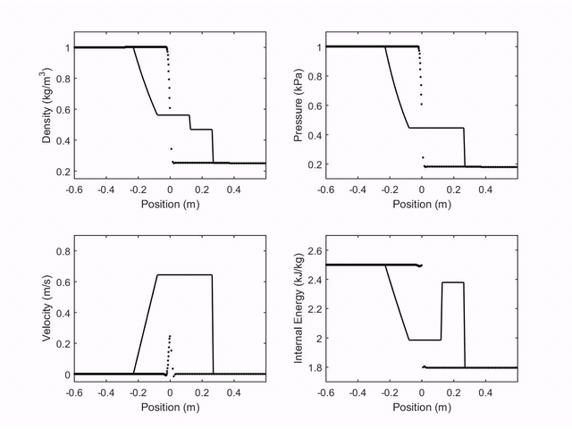

# SMOOTHED-PARTICLE HYDRODYNAMICS (SPH)

## Table of contents

* [General info](#general-info)
* [Technologies](#technologies)
* [Setup](#setup)
* [Expected Results](#expected-results)
* [References](#references)

## General info

This project is the result of my undergraduated research in Computational Fluid Dynamics (CFD) using the method known as Smoothed Particles Hydrodynamics (SPH), under the guidance of Professor Joel Roberto Guimarães Vasco at the Federal University of Goiás (UFG). The goal of this project was to build a start point for a new research branch in CFD at UFG using a particle-based method, which has several advantages for problems with huge deformations, complex geometry, and free-surfaces.

The project has a code for one-dimensional problems, with a shock wave in the Sod's Tube as an application of it. Furthermore, the project has also a code for two-dimensional heat transport in solids. Despite this, there are plans to extend the code for overall two-dimensional fluid dynamics cases. One has also included three-dimensional cases in these plans.

More about the project can be found in :

## Technologies

Project is created with:

* MATLAB version: 2015a

## Setup

Clone the code to your PC, open the main files (mainSodTube.m or mainPlate.m ) with your MATLAB, and run them.

## Expected Results

The first case studied was the shock tube in the Sod's Tube. Four properties were observed (velocity, density, pressure and internal energy represened by dots), and compared with the analytical result of the problem (continus line). The following plot shows the observed properties through time: 

     
The second case studied was a two-dimensional rectangular plate on which was imposed different temperatures on each side. The following plot shows the time evolution of heat transport inside the plate by conduction.        
     
 
     
## References

Bonet, J.and Lok, T-S. L., 1999. Variational and momentum preservation aspects of smoothed particle hydrodynamics formulation. *Comput. Methods Appl. Mech. Engrg.*, 180, pp. 95-115.

Cleary, P. W. and Monaghan, J. J., 1999. Conduction modelling using smoothed particle hydrodynamics. *Journal of Computational Physics*, 148, pp. 227-264.

Liu, G. R. and Liu, M. B., 2003. *Smoothed Particle Hydrodynamics: a meshfree particle method.* Singapore: World Scientific Publishing Co. Pte. Ltd.

Lucy, L. B., 1977. A numerical approach to the testing of the fusion hypothesis. *The Astronomical Journal*, 82(12), pp. 1013-1024.

Monaghan, J. J. and Gingold, R. A., 1977. Smoothed particle hydrodynamics: theory and application to non-spherical stars. *Mon. Not. R. ast. Soc.*, 181, pp. 375-389.

Monaghan, J. J. and Gingold, R. A., 1983. Shock simulation by the particle method SPH. *Journal of Computational Physics*, 52, pp. 374-389

Sod, G. A., 1978. A survey of several finite difference methods for systems of nonlinear hyperbolic conservation laws. *Journal of Computational Physics*, 27, pp. 1-31.
